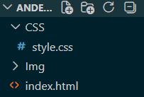

# Portafolio Personal
### _Nombre del proyecto_ 🚀

### _Versión: _

#### ✅ Descripcion del proyecto:
Este proyecto fue realizado con las tecnologías HTML y CSS en el cual se describe mi trayectoria académica, conocimientos e intereses tecnológicos

## 👾 *Como ver el proyecto*
- Visitar la página web publicada en Github Pages:
[anderson-oloroso.github.io](https://anderson-oloroso.github.io)

## 👾 *Archivos del proyecto*

## 💻 *Tecnologías utilizadas*
- HTML5
- CSS3

## 👤 _Creador_
#### *Nombre:* <u>Henrik Anderson Oloroso García</u>
##### *Ultima modificación:* <u>10/04/2025</u> 
